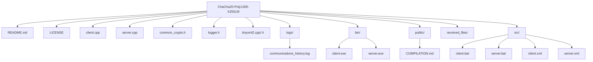

# Secure Communication System with ChaCha20-Poly1305 and X25519

## 🔐 Project Overview
This project implements a secure, multi-client communication system in C++ using modern cryptographic algorithms: **ChaCha20-Poly1305** for authenticated encryption and **X25519** for secure key exchange. It allows simultaneous connections from multiple clients to a central server, enabling encrypted real-time messaging and file transfer with built-in logging and full control from the server side.

> Designed as a robust, modular, and real-world secure communication platform.

---

## ✨ Key Features
- ✅ **End-to-end encryption** using ChaCha20-Poly1305 (AEAD).
- ✅ **Ephemeral session keys** via X25519 ECDH key exchange.
- ✅ **Multiclient support** with unique session per client.
- ✅ **Encrypted file transfer** including metadata (name, size).
- ✅ **Binary communication protocol** (type + length + data).
- ✅ **XML-based configuration** for IP/PORT.
- ✅ **Custom command interface** for both client and server.
- ✅ **Logging system** for all communications.
- ✅ **Safe packet reconstruction** before decryption.

---

## 🌐 System Architecture
```
  +------------+             +-------------+
  |  Client 1  | <--+     +->|  Server     |<--+--> Client N
  +------------+    |     |  +-------------+   |
  |  ChaCha20  |<---+     +--|  X25519     |   +-> Logger
  +------------+             +-------------+
```
- Each client initiates connection and performs **ECDH** handshake.
- A unique **symmetric session key** is derived.
- All communication is **encrypted + authenticated** using ChaCha20-Poly1305.
- Server handles multiple clients concurrently with threading.

---

## 📂 Project Structure


---

## ⚖️ Requirements
- **C++17** or higher
- **OpenSSL** (1.1.1+)
- **TinyXML2**
- **g++ (MinGW-w64)** for Windows

---

## ⚙️ Compilation (Windows with g++)
```bash
g++ client.cpp tinyxml2.cpp -lws2_32 -lssl -lcrypto -o bin/client.exe
g++ server.cpp tinyxml2.cpp -lws2_32 -lssl -lcrypto -o bin/server.exe
```
Ensure that the DLLs from OpenSSL are accessible at runtime (`libssl`, `libcrypto`).

---

## 🚀 Execution
Use the `.bat` scripts to run:
```bash
src/client.bat
src/server.bat
```
They load config from:
- `client.xml` for the client
- `server.xml` for the server

Each file contains:
```xml
<config>
  <ip>127.0.0.1</ip>
  <port>40000</port>
</config>
```

---

## 🔐 Cryptography in Detail
- **X25519**: Each connection uses ephemeral keys to derive a shared session key securely.
- **ChaCha20-Poly1305**:
  - 256-bit key
  - 96-bit nonce
  - 128-bit authentication tag
- Nonces and keys are generated using secure RNG (OpenSSL).

---

## ✉️ Binary Protocol
Every message is sent in this format:
```
[ 4 bytes length ] [ 1 byte type ] [ encrypted content ] [ 16 bytes tag ]
```
- Types:
  - `0x01` Text message
  - `0xAA` Encrypted file with metadata
  - `0x04` Broadcast message
  - `0xFF` Exit / shutdown

---

## 📄 File Transfer & Metadata
- Command: `file <path>`
- Payload structure (encrypted):
```
[4 bytes client ID][4 bytes name_len][filename][8 bytes size][file_data]
```
- Files are saved on the server in `received_files/`
- All parts (name, size, content) are encrypted.

---

## 🔄 Communication Flow
1. Client connects and receives server public key
2. Client sends its public key
3. Server derives shared key and sends nonce
4. Communication begins: encrypted messages/files
5. Messages are reconstructed based on length before decryption

---

## 🔐 Client Selection & Multiuser Control
- Each client gets a unique 4-digit ID
- Server operator can:
  - List connected clients: `list`
  - Send private messages: `send <id> <msg>`
  - Broadcast to all: `broadcast <msg>`

---

## 🔑 Key & Session Management
- Keys are **ephemeral** and regenerated on every connection
- No key is stored on disk
- Each session is uniquely encrypted

---

## ✅ Security Best Practices
- AEAD cipher ensures **confidentiality + authenticity**
- No plaintext metadata transmitted
- Per-client encryption avoids shared state
- Secure random generation for all nonces and keypairs
- Logs never store plaintext content

---

## 📃 Example Output
```bash
mario@server:~$ list
[*] Connected clients:
  ID: 1032
  ID: 4821

mario@server:~$ send 1032 Hola, cliente 1032
[>] Message sent to Client 1032

mario@client[1032]:~$ file C:/Users/user/Desktop/test.pdf
[*] Archivo enviado: test.pdf (14358 bytes)
```

---

## 📋 Example Log File
Logs are automatically stored with timestamp, source, and message. Sample:
```log
[2025-04-16 00:01:01.646] [Servidor 1842] Cliente conectado
[2025-04-16 00:01:08.984] [Servidor 7935] Cliente conectado
[2025-04-16 00:01:12.122] [Servidor 6263] Cliente conectado
[2025-04-16 00:03:20.371] [Broadcast 6263] Hola a todos los clientes
[2025-04-16 00:03:20.371] [Broadcast 7935] Hola a todos los clientes
[2025-04-16 00:03:20.371] [Broadcast 1842] Hola a todos los clientes
[2025-04-16 00:03:20.372] [Servidor -1] Broadcast: Hola a todos los clientes
[2025-04-16 00:03:45.434] [Servidor 7935] Hola cliente individual
[2025-04-16 00:04:11.820] [Cliente 1842] Hola Servidor, soy un Cliente
[2025-04-16 00:04:46.816] [Cliente 6263] Oye Servidor, te voy a enviar un NFT
[2025-04-16 00:05:42.763] [Cliente 6263] Archivo recibido: NFT_V5.jpg (72523 bytes)
[2025-04-16 00:06:09.480] [Servidor 6263] Recibido el NFT, muchas gracias
[2025-04-16 00:06:17.591] [Cliente 7935] Adios
[2025-04-16 00:06:20.620] [Servidor 7935] Cliente desconectado
[2025-04-16 00:06:35.365] [Cliente 6263] Tengo que irme
[2025-04-16 00:06:37.895] [Servidor 6263] Cliente desconectado
[2025-04-16 00:07:00.628] [Servidor -1] Server terminated via 'exit' command.
```

📄 Full log file available here: [communications_history.log](https://github.com/marichu-kt/ChaCha20-Poly1305-X25519/blob/main/logs/communications_history.log)

---

## 🌍 License  
This project is licensed under a custom educational license.  
See the full license here: [LICENSE](https://github.com/marichu-kt/ChaCha20-Poly1305-X25519/blob/main/LICENSE)

---

## 📄 Credits
Developed by [@marichu_kt](https://github.com/marichu-kt)  
Official Repository: [ChaCha20-Poly1305-X25519](https://github.com/marichu-kt/ChaCha20-Poly1305-X25519)
