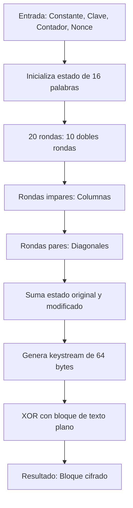

# ChaCha20-Poly1305: Una Guía Completa

Bienvenido(a) a esta guía sobre ChaCha20-Poly1305, un **algoritmo de cifrado y autenticación** ampliamente utilizado en la actualidad. A lo largo de este documento, exploraremos en detalle qué es ChaCha20, cómo funciona internamente y por qué se combina con Poly1305 para formar un esquema de cifrado **AEAD (Authenticated Encryption with Associated Data)** seguro y eficiente.


---
## ¿Qué es ChaCha20?

ChaCha20 es un **cifrado de flujo** (stream cipher) diseñado por Daniel J. Bernstein. Se considera una variante mejorada del cifrado Salsa20, optimizada en términos de seguridad y rendimiento en diversas plataformas, incluyendo dispositivos móviles y entornos de bajo consumo energético.

### Orígenes y Motivación
- **Diseñador**: Daniel J. Bernstein, conocido por sus aportes en criptoanálisis y diseño de sistemas cifrados.
- **Objetivo**: Crear un cifrado de flujo altamente seguro, rápido y fácil de implementar en hardware y software, superando algunas debilidades y limitaciones de otros cifrados de flujo más antiguos.

### Poly1305
Poly1305 es un algoritmo de **autenticación de mensajes** (Message Authentication Code, MAC) también creado por Daniel J. Bernstein. Cuando se combina con ChaCha20, se obtiene ChaCha20-Poly1305, un modo de cifrado autenticado (AEAD) que no solo cifra los datos, sino que **garantiza su integridad** y la **autenticidad** de los mismos.


---

## Importancia y uso hoy en día

ChaCha20-Poly1305 ha ganado popularidad por varias razones:

- **Rendimiento**: Funciona muy rápido en plataformas que no tienen aceleración por hardware para AES.
- **Seguridad**: Hasta la fecha, no se conocen ataques prácticos capaces de romper su seguridad cuando se implementa correctamente.
- **Versatilidad**: Se puede usar en entornos con diferentes arquitecturas (32 bits, 64 bits, ARM, x86, etc.) sin pérdida significativa de velocidad.
- **Estándar de Internet**: Es recomendado por organismos de estandarización como el IETF (Internet Engineering Task Force) y utilizado en protocolos como TLS 1.3 y QUIC.

---

## Diferencias con AES y otras alternativas

1. **Estructura interna**:  
   - **AES** (Advanced Encryption Standard) es un cifrado por bloques (block cipher) que opera en bloques de 128 bits.  
   - **ChaCha20**, en cambio, es un **cifrado de flujo**, generando una secuencia de bits (keystream) que se combina con el texto para cifrar.

2. **Arquitectura hardware**:  
   - AES se beneficia mucho de las **instrucciones especiales** en CPUs modernas (por ejemplo, AES-NI en Intel).  
   - ChaCha20 puede ser **más eficiente** en dispositivos que **no** cuentan con esas instrucciones especiales.

3. **Complejidad de implementación**:  
   - ChaCha20 suele ser más **simple** de implementar de forma segura.  
   - AES, si no se aprovechan las instrucciones hardware, puede ser más **complejo** y propenso a errores de implementación.

4. **Ataques side-channel**:  
   - ChaCha20, por su naturaleza de operaciones (rotaciones, sumas), puede ser menos susceptible a ciertos **ataques de canal lateral** (side-channel attacks).  
   - AES, sin las optimizaciones adecuadas, puede quedar expuesto a ataques que midan tiempos o accesos a memoria.

---

## Explicación del funcionamiento interno

### Estado inicial (constante, clave, contador, nonce)

ChaCha20 opera sobre un **estado interno** de 16 palabras (cada palabra tiene 32 bits). Estas 16 palabras se forman a partir de:
1. **Cuatro palabras constantes**: suelen ser valores fijos definidos por el algoritmo.
2. **Ocho palabras** derivadas de la **clave** de 256 bits (32 bytes).
3. **Una palabra** para el **contador** (32 bits).
4. **Tres palabras** para el **nonce** (96 bits).

Podemos imaginar este estado como una **matriz de 4x4** palabras de 32 bits cada una:

```
 ┌────────────┬────────────┬────────────┬────────────┐
 | Constante0 | Constante1 | Constante2 | Constante3 |
 ├────────────┼────────────┼────────────┼────────────┤
 |   Clave0   |   Clave1   |   Clave2   |   Clave3   |
 ├────────────┼────────────┼────────────┼────────────┤
 |   Clave4   |   Clave5   |   Clave6   |   Clave7   |
 ├────────────┼────────────┼────────────┼────────────┤
 |  Contador  |   Nonce0   |   Nonce1   |   Nonce2   |
 └────────────┴────────────┴────────────┴────────────┘
```

### Quarter Round

Una **Quarter Round** (ronda de cuarto) es una secuencia de operaciones que toma cuatro palabras (a, b, c, d) y las transforma para dispersar los bits. Implica sumas, rotaciones y XORs.


### Double Round

ChaCha20 define 20 rondas, como 10 double rounds:
- Una ronda de quarter rounds a las **columnas**.
- Otra ronda de quarter rounds a las **diagonales**.

### Generación del keystream

1. Se toma el estado inicial.
2. Se aplican las 20 rondas.
3. Se suma el estado resultante con el original.
4. Se obtiene un **keystream** de 64 bytes.
5. Se aplica **XOR** con el texto plano.


```mermaid
flowchart TD
    A[Entrada: Constante, Clave, Contador, Nonce] --> B[Inicializa estado de 16 palabras]
    B --> C[20 rondas: 10 dobles rondas]
    C --> D1[Rondas impares: Columnas]
    D1 --> D2[Rondas pares: Diagonales]
    D2 --> E[Suma estado original y modificado]
    E --> F[Genera keystream de 64 bytes]
    F --> G[XOR con bloque de texto plano]
    G --> H[Resultado: Bloque cifrado]
```

---

## Cómo Poly1305 aporta autenticación

- Crea una etiqueta de autenticación (MAC) usando una clave derivada de ChaCha20.
- Protege tanto el mensaje cifrado como datos adicionales no cifrados (como cabeceras).
- Asegura que el mensaje no ha sido modificado.

---

## Ventajas, limitaciones y casos de uso reales

**Ventajas:**
- Rápido en software sin soporte AES.
- Seguro y moderno.
- Fácil de implementar correctamente.

**Limitaciones:**
- Requiere un nonce **único** por mensaje.

**Usos reales:**
- TLS 1.3
- HTTP/3 (QUIC)
- WireGuard
- WhatsApp y Signal

---

## Pequeño resumen final

ChaCha20-Poly1305 es un sistema de cifrado y autenticación robusto, rápido y seguro. El cifrado ChaCha20 crea un flujo de bits (keystream) que se combina con el texto plano mediante XOR, asegurando la confidencialidad. Poly1305 se encarga de generar un código de autenticación que protege la integridad de los datos y la veracidad de la fuente. Gracias a su gran rendimiento en plataformas sin aceleración AES y a su sencillez, ChaCha20-Poly1305 se ha convertido en un estándar muy utilizado en la actualidad.

---

## Referencias

- Bernstein, D. J. (2008). *ChaCha, a variant of Salsa20*.
- Bernstein, D. J. (2005). *The Poly1305-AES message-authentication code*.
- IETF RFC 8439: [ChaCha20 and Poly1305 for IETF Protocols](https://datatracker.ietf.org/doc/html/rfc8439)
- IETF RFC 8446: [TLS 1.3](https://datatracker.ietf.org/doc/html/rfc8446)
